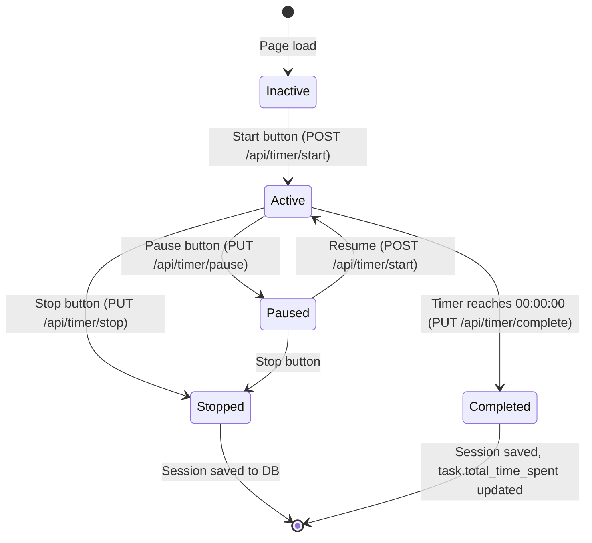

# Plan: Countdown Timer Integration — smart_wish_tracker → live_interview

## Goal

Adopt the full-featured countdown timer from [`smart_wish_tracker/templates/countdown.html`](https://github.com/bakunobu/smart_wish_tracker/blob/main/templates/countdown.html) into the live_interview project. This includes: circular SVG progress ring, Start/Pause/Stop controls, task selection with autocomplete, timer session tracking via API, daily statistics, and a statistics modal.

## Source Analysis

### What countdown.html Provides

| Feature | Description |
|---------|-------------|
| Circular SVG progress ring | 300×300 SVG with `progress-circle`, `progress-arc`, `progress-point` — animates as timer counts down |
| Clock display | `HH:MM:SS` inside the circle, clickable to set custom time |
| Start/Pause/Stop controls | Three buttons with session management |
| Task management panel | Up to 5 task slots with add/edit/delete, autocomplete dropdown, per-task statistics |
| TimerSession class | Client-side JS class that calls `/api/timer/start`, `/api/timer/stop`, `/api/timer/complete` |
| TaskStorage class | Client-side JS class that calls `/api/tasks` for CRUD + `/api/tasks/suggestions` for autocomplete |
| DailyStats class | Calls `/api/daily-stats` to populate mood emoji, tasks count, time spent, completion % |
| TaskStatistics class | Calls `/api/timer/stats` for per-task success rate and total time |
| Statistics modal | Full-screen modal with session history, overview stats |
| Quest block | Additional "Quests" section below the main timer |

### Problems with countdown.html

1. **Unresolved git merge conflicts** — `<<<<<<< HEAD` / `=======` / `>>>>>>>` markers throughout the entire file (lines 17-3405)
2. **API endpoints don't exist in live_interview** — `/api/timer/*`, `/api/tasks`, `/api/daily-stats` are all missing
3. **Uses localStorage + API hybrid** — TaskStorage falls back to localStorage when API fails; live_interview should be DB-only
4. **MAX_TASKS = 5 hardcoded** — doesn't match live_interview's Project→Task→Subtask hierarchy
5. **Dark theme** (`#1a1a2e`, `#0f3460`) — doesn't match live_interview's light theme (`#f8f9fa`, `#fff`)

### What smart_wish_tracker Backend Has

- [`routes.py`](app/routes.py) — only basic `/start`, `/stop/<id>` endpoints with a simple `TimeEntry` model
- [`models.py`](app/models.py) — `TimeEntry(id, description, start_time, end_time, project)` — no session tracking, no statistics
- **The countdown.html JS is far more advanced than the backend** — the backend is essentially a stub

## Architecture Decision: What to Keep, What to Adapt

### Keep from countdown.html (after cleaning merge conflicts)

| Component | Decision |
|-----------|----------|
| Circular SVG progress ring | **Keep** — adapt colors to light theme |
| Clock display + click-to-edit | **Keep** — core timer UX |
| Start/Pause/Stop buttons | **Keep** — wire to new backend endpoints |
| TimerSession class | **Adapt** — change from localStorage fallback to DB-only; link to Task/Subtask IDs |
| Task selection dropdown | **Adapt** — populate from live_interview's `Task.query` and `Subtask.query` instead of localStorage |
| Autocomplete | **Simplify** — use existing DB tags/task names, no separate `/api/tasks/suggestions` needed |
| Daily stats block | **Keep** — wire to new `/api/daily-stats` endpoint |
| Progress animation | **Keep** — the `progress-arc` stroke-dashoffset animation |

### Discard / Simplify

| Component | Decision |
|-----------|----------|
| TaskStorage class (localStorage hybrid) | **Discard** — live_interview is DB-only via SQLAlchemy |
| MAX_TASKS = 5 limit | **Discard** — use actual DB task count |
| Quest block | **Discard** — not relevant to live_interview's domain |
| Statistics modal (full-screen) | **Simplify** — integrate stats into the existing dashboard cards, not a separate modal |
| Dark theme CSS | **Replace** — use live_interview's existing light theme |

## Implementation Plan

### Step 1: Add `TimerSession` model to [`models.py`](models.py)

A new SQLAlchemy model to track individual timer sessions:

```python
class TimerSession(db.Model):
    __tablename__ = "timer_sessions"

    id = db.Column(db.Integer, primary_key=True)
    task_id = db.Column(db.Integer, db.ForeignKey("tasks.id"), nullable=True)
    subtask_id = db.Column(db.Integer, db.ForeignKey("subtasks.id"), nullable=True)
    planned_duration = db.Column(db.Integer, default=0)  # seconds
    actual_duration = db.Column(db.Integer, default=0)   # seconds
    status = db.Column(db.String(20), default="inactive")  # active|paused|completed|stopped
    start_time = db.Column(db.DateTime, nullable=True)
    end_time = db.Column(db.DateTime, nullable=True)
    created = db.Column(db.DateTime, default=lambda: datetime.now(timezone.utc))

    task = db.relationship("Task", back_populates="timer_sessions")
    subtask = db.relationship("Subtask", back_populates="timer_sessions")
```

Also add `timer_sessions` relationship to `Task` and `Subtask` models.

### Step 2: Add Timer API Endpoints to [`app.py`](app.py)

| Endpoint | Method | Purpose | Countdown.html Caller |
|-----------|--------|---------|----------------------|
| `/api/timer/start` | POST | Start a timer session for a task/subtask | `TimerSession.start()` |
| `/api/timer/pause` | PUT | Pause a running session | `TimerSession` (pause logic) |
| `/api/timer/stop` | PUT | Stop and finalize a session | `TimerSession.stop()` |
| `/api/timer/complete` | PUT | Mark session as completed (timer reached 0) | `TimerSession.complete()` |
| `/api/tasks` | GET | List all non-deleted tasks with their subtasks (for dropdown) | `TaskStorage.loadTasks()` |
| `/api/daily-stats` | GET | Aggregate today's stats: tasks completed, time spent, completion % | `DailyStats.fetchStats()` |
| `/api/timer/stats` | GET | Per-task statistics: success rate, total time, attempts | `TaskStatistics.getTaskStats()` |

### Step 3: Extract Clean Timer JavaScript

Take the core timer logic from countdown.html (lines ~1205-3405), resolve all merge conflicts, and produce a clean `timer.js` module:

**Key classes to extract:**
- `TimerSession` — manages start/pause/stop/complete lifecycle, calls API endpoints
- `DailyStats` — fetches and renders daily statistics
- `TaskStatistics` — fetches per-task stats

**Key functions to extract:**
- `updateClockDisplay()` — formats `totalSeconds` as `HH:MM:SS`
- `updateProgressRing()` — animates the SVG arc based on elapsed/total ratio
- `startTimer()`, `pauseTimer()`, `stopTimer()`, `resetTimer()` — control flow
- `selectTask()` — sets `currentTask` and updates the display
- `renderTaskDropdown()` — populates task selector from API

**What changes from the original:**
- Remove `localStorage` fallback — all data goes through API → DB
- Remove `MAX_TASKS` constant — use actual DB count
- Remove `TaskStorage` class — replace with direct `fetch('/api/tasks')` calls
- Remove `autocompleteCache` — use server-side suggestions endpoint
- Remove Quest block logic entirely
- Adapt color scheme from dark to light theme

### Step 4: Replace [`home.html`](templates/home.html) Timer Block

The current Timer block (lines 338-347) is a static placeholder:

```html
<div class="card timer-block">
    <div class="card-title">⏱ Timer</div>
    <div class="timer-display">00:00:00</div>
    <div class="timer-label">No task selected</div>
    <div class="timer-controls">
        <button class="btn-timer btn-start" disabled>▶ Start</button>
        <button class="btn-timer btn-pause" disabled>⏸ Pause</button>
        <button class="btn-timer btn-reset" disabled>↺ Reset</button>
    </div>
</div>
```

**Replace with:** Full countdown timer UI including:
- Circular SVG progress ring (200×200, scaled down from 300×300)
- Task/subtask selector dropdown (populated from DB)
- Active Start/Pause/Reset buttons (no longer disabled)
- Daily stats mini-panel below the timer
- Timer label showing current task name

### Step 5: Wire Task Selection to DB

The task selector dropdown will query `/api/tasks` which returns:

```json
{
  "tasks": [
    {
      "id": 1,
      "description": "...",
      "project_id": 1,
      "project_name": "...",
      "estimated_time": 3600,
      "subtasks": [
        {"id": 10, "description": "...", "estimated_time": 1800}
      ]
    }
  ]
}
```

The dropdown shows: `Project Name > Task Description` with subtasks as nested options.

### Step 6: Update [`project.html`](templates/project.html)

Add a mini timer display per task/subtask row showing:
- Inline ▶ Start button that pre-selects that task in the main timer
- Elapsed time display (updates from `total_time_spent`)

### Step 7: Test Integration

- Start a timer for a task → verify `TimerSession` row created
- Let timer run → verify `progress-arc` animates
- Pause → verify session status = "paused"
- Stop → verify `actual_duration` saved, `task.total_time_spent` updated
- Complete → verify timer reaches 0, session marked "completed"
- Daily stats → verify endpoint returns correct aggregates

## Files Changed Summary

| File | Change Type | Description |
|------|-------------|------------|
| [`models.py`](models.py) | Add | `TimerSession` model + relationships on `Task`, `Subtask` |
| [`app.py`](app.py) | Add | 7 new API endpoints for timer/task/daily-stats |
| [`templates/home.html`](templates/home.html) | Replace | Timer block → full countdown UI with SVG ring + task selector |
| [`templates/project.html`](templates/project.html) | Modify | Add inline timer controls per task/subtask row |
| `static/timer.js` | New | Clean extracted timer JS (no merge conflicts, DB-only) |
| `static/timer.css` | New | Timer-specific styles (circular ring, controls, dropdown) |

## Mermaid: Timer Session Lifecycle



## Mermaid: Data Flow

```mermaid
flowchart TD
    A[home.html Timer Block] --> B[timer.js]
    B --> C{User Action}
    C -->|Select Task| D[GET /api/tasks]
    D --> E[(SQLAlchemy Task/Subtask)]
    C -->|Start Timer| F[POST /api/timer/start]
    F --> G[(TimerSession)]
    C -->|Pause/Stop| H[PUT /api/timer/stop]
    H --> G
    C -->|Timer Complete| I[PUT /api/timer/complete]
    I --> J[Update Task.total_time_spent]
    B --> K[GET /api/daily-stats]
    K --> L[Aggregate today's sessions]
    L --> M[Render daily stats panel]