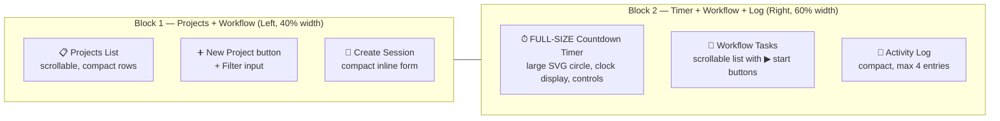

# Homepage Relayout — Compact 2-Block Design

## Overview

Restructure [`templates/home.html`](templates/home.html) dashboard into two logical blocks with a full-size countdown timer and zero wasted space. Pure CSS/HTML — no backend changes, all existing JS and Jinja2 preserved.

## Target Layout



```
┌────────────────────┬──────────────────────────────────────┐
│                    │                                      │
│   📋 Projects      │        ⏱ COUNTDOWN TIMER            │
│   (scrollable)     │        ┌─────────────┐              │
│                    │        │    SVG       │              │
│   • Project A      │        │   Circle     │              │
│   • Project B      │        │   200×200    │              │
│   • Project C      │        │              │              │
│                    │        │  00:42:15    │              │
│   [+ New] [Filter] │        └─────────────┘              │
│                    │        [▶ Start] [⏸ Pause] [■ Stop] │
│                    │        Task: Build API endpoint      │
│                    │                                      │
│   🎯 Create Session│   ─────────────────────────────────  │
│   [Duration][Inten]│                                      │
│   [Generate]       │   📅 Workflow                       │
│                    │   • Task #1 — Project X  ↻ 0:15  ▶  │
│                    │   • Task #2 — Project Y  ↻ 1:02  ▶  │
│                    │   • Task #3 — Project Z  ↻ 0:00  ▶  │
│                    │                                      │
│                    │   📜 Activity Log                    │
│                    │   15:42 [complete] Subtask done      │
│                    │   15:30 [split] Task split into 3    │
│                    │   14:55 [promote] Subtask promoted   │
│                    │   14:20 [archive] Project archived   │
└────────────────────┴──────────────────────────────────────┘
```

## CSS Grid Structure

```css
.dashboard {
    display: grid;
    grid-template-columns: 2fr 3fr;   /* 40% / 60% split */
    grid-template-rows: 1fr;          /* single row, full height */
    gap: 16px;
    height: calc(100vh - 120px);      /* fill viewport minus nav */
    min-height: 600px;
}
```

- **Left column (2fr)**: Single card containing Projects + Session form, scrollable internally
- **Right column (3fr)**: Flex column stacking Timer → Workflow → Log, each filling available space

## Block 1 — Projects + Workflow Creation (Left)

Single card with internal sections:

| Section | Content |
|---------|---------|
| **Header** | "📋 Projects" title + `[+ New]` button + filter input in one row |
| **List body** | Scrollable project rows — compact: description, priority badge, task count, Open button |
| **Session form** | Compact inline: Duration + Intensity + Generate button (single row) |

```html
<div class="card block-projects">
    <div class="card-title" style="display:flex; justify-content:space-between;">
        <span>📋 Projects</span>
        <span>
            <input type="text" placeholder="Filter..." style="width:140px;">
            <a href="/decompose"><button class="btn-sm">+ New</button></a>
        </span>
    </div>
    <div class="list-body" style="flex:1; overflow-y:auto;">
        <!-- existing project rows -->
    </div>
    <div style="border-top:1px solid #eee; padding-top:10px; margin-top:8px;">
        <div style="display:flex; gap:8px; align-items:end;">
            <div style="flex:1;">
                <label style="font-size:11px;">Duration</label>
                <input id="session-duration" value="60" min="15" max="240" style="width:100%;">
            </div>
            <div style="flex:1;">
                <label style="font-size:11px;">Intensity</label>
                <select id="session-intensity" style="width:100%;">
                    <option value="low">Low</option>
                    <option value="medium" selected>Medium</option>
                    <option value="high">High</option>
                </select>
            </div>
            <button id="session-generate" style="...">Generate</button>
        </div>
        <div id="session-results" style="display:none; max-height:100px; overflow-y:auto;"></div>
    </div>
</div>
```

## Block 2 — Timer + Workflow + Log (Right)

Flex column with 3 sections, no gaps:

```css
.block-timer-area {
    display: flex;
    flex-direction: column;
    height: 100%;
    gap: 12px;
}
```

| Section | Height | Content |
|---------|--------|---------|
| **Timer** | `flex: 1` (takes remaining space) | Full-size SVG circle (scales to fill), clock display, task selector, controls, today-stats bar |
| **Workflow** | `max-height: 35%` | Scrollable task list, max 5 visible |
| **Log** | `max-height: 20%` | Compact log entries, max 4 visible |

### Timer — Full-Size

The timer SVG circle should scale to fill its container. Use `viewBox` and relative sizing:

```css
.timer-block {
    flex: 1;
    display: flex;
    flex-direction: column;
    align-items: center;
    justify-content: center;
    min-height: 280px;
}
.timer-block svg {
    width: 100%;
    max-width: 280px;
    height: auto;
}
```

The clock digits should be large and prominent (36-42px font).

### Workflow — Compact

```css
.workflow-list {
    max-height: 180px;
    overflow-y: auto;
}
```

Each row: `checkbox | Task #N | Project name | elapsed time | ▶ button`

### Log — Compact

```css
.log-body {
    max-height: 120px;
    overflow-y: auto;
    font-size: 11px;
}
```

## What Gets Removed

- **Stats block** — merged into the timer card as a compact bar below the controls
- **Separate Session card** — merged into the Projects card bottom
- **`grid-row` inline styles** — replaced by semantic grid placement
- **Empty/whitespace gaps** — `height: calc(100vh - 120px)` ensures the dashboard fills the viewport

## What Stays

- All element IDs: `timer-clock`, `timer-start`, `timer-pause`, `timer-stop`, `timer-task-select`, `timer-label`, `session-generate`, `session-duration`, `session-intensity`, `session-focus`, `session-diversity`, `session-results`, `session-tasks`
- All Jinja2 loops: ``, ``
- All JS: timer.js include, session creation fetch logic, daily stats fetch
- Navigation tabs (already updated with auth links)

## Files Changed

| File | Change |
|------|--------|
| [`templates/home.html`](templates/home.html) | Full CSS grid rewrite + HTML restructure within `.dashboard` |

**No backend changes. No new files. Single file edit.**