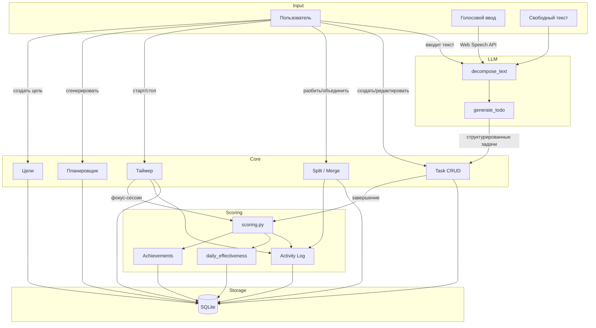

# Органайзер и Тайм-Трекер — Архитектурный План v2

## 1. Обзор концепции

Приложение-органайзер с элементами тайм-трекинга, agile-планирования и геймификации. Основная цель — помочь пользователю провести **наиболее эффективный день**, балансируя между продуктивностью и напряженностью.

### Ключевые возможности:
- **3-уровневая иерархия задач**: Эпик → Задача → Подзадача, с акцентом на подзадачи до 2 часов
- **Умное планирование дня**: Полностью автоматическое составление расписания из пула задач
- **Трекинг времени**: Плановые оценки + фактический учет (старт/стоп таймер)
- **Геймификация**: Оценка эффективности дня, streaks, ачивки за контекст выполнения
- **Умное слияние/разбиение**: На основе сложности — слишком сложные разбиваются, простые объединяются
- **Ввод из неструктурированного текста**: Текст (и голос) → LLM → структурированные задачи с оценкой времени
- **Большие цели**: Три типа — по результату, по длительности, по непрерывному стеку
- **Теги (эпики)**: Единый механизм группировки, many-to-many с задачами

---

## 2. Модель данных (SQLite)

### 2.1 Таблицы

```sql
-- ============================================================================
-- Ядро: задачи
-- ============================================================================
tasks
├── id                  INTEGER PRIMARY KEY
├── parent_id           INTEGER REFERENCES tasks(id) ON DELETE CASCADE  -- NULL = корень
├── title               TEXT NOT NULL
├── description         TEXT
├── status              TEXT CHECK(status IN ('todo','in_progress','done')) DEFAULT 'todo'
├── priority            INTEGER CHECK(priority BETWEEN 1 AND 5) DEFAULT 3  -- 1=критично, 5=низко
├── estimated_minutes   INTEGER  -- плановая оценка в минутах
├── complexity          INTEGER CHECK(complexity BETWEEN 1 AND 5)  -- 1=легко, 5=сложно
├── energy_required     INTEGER CHECK(energy_required BETWEEN 1 AND 5)  -- 1=низкая энергия, 5=высокая
├── is_procrastinated   BOOLEAN DEFAULT 0  -- пользователь отметил как "откладываемую"
├── sort_order          INTEGER NOT NULL DEFAULT 0
├── created_at          TEXT DEFAULT (datetime('now'))
├── updated_at          TEXT DEFAULT (datetime('now'))
└── completed_at        TEXT  -- NULL пока не завершена

-- ============================================================================
-- Теги / Эпики (единый механизм)
-- ============================================================================
tags
├── id                  INTEGER PRIMARY KEY
├── name                TEXT NOT NULL UNIQUE
├── color               TEXT DEFAULT '#6c757d'  -- hex цвет для UI
└── created_at          TEXT DEFAULT (datetime('now'))

task_tags
├── task_id             INTEGER REFERENCES tasks(id) ON DELETE CASCADE
├── tag_id              INTEGER REFERENCES tags(id) ON DELETE CASCADE
└── PRIMARY KEY (task_id, tag_id)

-- ============================================================================
-- Трекинг времени
-- ============================================================================
time_entries
├── id                  INTEGER PRIMARY KEY
├── task_id             INTEGER REFERENCES tasks(id) ON DELETE CASCADE
├── started_at          TEXT NOT NULL  -- ISO datetime
├── ended_at            TEXT  -- NULL = таймер еще идет
├── duration_seconds    INTEGER  -- вычисляется при остановке
├── is_manual           BOOLEAN DEFAULT 0  -- ручной ввод или авто-трек
└── notes               TEXT

-- ============================================================================
-- Цели (3 типа)
-- ============================================================================
goals
├── id                  INTEGER PRIMARY KEY
├── title               TEXT NOT NULL
├── description         TEXT
├── goal_type           TEXT CHECK(goal_type IN ('result','duration','streak'))
├── target_value        REAL     -- result: кол-во задач, duration: часы, streak: дни
├── current_value       REAL DEFAULT 0
├── reward              TEXT     -- пользователь определяет награду
├── status              TEXT CHECK(status IN ('active','completed','archived')) DEFAULT 'active'
├── deadline            TEXT     -- ISO date (может быть NULL)
├── created_at          TEXT DEFAULT (datetime('now'))
├── updated_at          TEXT DEFAULT (datetime('now'))
└── completed_at        TEXT

goal_tasks
├── goal_id             INTEGER REFERENCES goals(id) ON DELETE CASCADE
├── task_id             INTEGER REFERENCES tasks(id) ON DELETE CASCADE
└── PRIMARY KEY (goal_id, task_id)

-- ============================================================================
-- Ежедневное расписание
-- ============================================================================
daily_schedules
├── id                  INTEGER PRIMARY KEY
├── date                TEXT NOT NULL  -- ISO date 'YYYY-MM-DD'
├── task_id             INTEGER REFERENCES tasks(id) ON DELETE CASCADE
├── planned_order       INTEGER NOT NULL  -- порядок в расписании
├── planned_start       TEXT  -- 'HH:MM'
├── planned_end         TEXT  -- 'HH:MM'
├── actual_start        TEXT
├── actual_end          TEXT
├── is_completed        BOOLEAN DEFAULT 0
└── notes               TEXT
UNIQUE(date, task_id)

-- ============================================================================
-- Геймификация: логирование и скоринг
-- ============================================================================
activity_log
├── id                  INTEGER PRIMARY KEY
├── event_type          TEXT  -- 'task_created','task_completed','task_reopened',
│                             'goal_created','goal_completed',
│                             'split','merge','idle_detected','focus_session',
│                             'procrastinated_cleared','evening_push','achievement_earned'
├── entity_type         TEXT  -- 'task','goal','timer','system'
├── entity_id           INTEGER
├── description         TEXT
├── score_delta         REAL DEFAULT 0  -- вклад в очки эффективности
├── metadata            TEXT  -- JSON для дополнительного контекста
└── created_at          TEXT DEFAULT (datetime('now'))

daily_effectiveness
├── id                  INTEGER PRIMARY KEY
├── date                TEXT NOT NULL UNIQUE
├── total_score         REAL DEFAULT 0
├── tasks_completed     INTEGER DEFAULT 0
├── estimated_hours     REAL DEFAULT 0
├── actual_hours        REAL DEFAULT 0
├── focus_score         REAL DEFAULT 0      -- % времени без отвлечений
├── completion_rate     REAL DEFAULT 0      -- % выполненных из запланированных
├── procrastination_bonus REAL DEFAULT 0    -- бонус за выполнение откладываемых
├── evening_push_bonus  REAL DEFAULT 0      -- бонус за вечернюю работу без переноса
├── complexity_bonus    REAL DEFAULT 0      -- бонус за сложные задачи
└── streak_days         INTEGER DEFAULT 0

achievements
├── id                  INTEGER PRIMARY KEY
├── key                 TEXT NOT NULL UNIQUE  -- 'first_10_tasks','streak_7','procrastination_slayer',...
├── title               TEXT NOT NULL
├── description         TEXT
├── icon                TEXT  -- emoji или имя иконки
├── earned_at           TEXT  -- NULL = еще не получено
└── metadata            TEXT  -- JSON
```

### 2.2 Ключевые решения

| Решение | Обоснование |
|---------|-------------|
| **`parent_id` вместо вложенных JSON** | Поддержка 3 уровней (depth ≤ 2: корень→задача→подзадача). SQL-запросы проще. |
| **`complexity` + `energy_required`** | Нужны для умного расписания — баланс между сложными и легкими задачами |
| **`is_procrastinated` флаг** | Позволяет системе давать бонус за выполнение откладываемых задач |
| **`time_entries` отдельной таблицей** | Полная история трекинга, сессии, паузы |
| **`daily_schedules`** | Расписание на конкретный день — система наполняет автоматически |
| **`daily_effectiveness`** | Материализованный скоринг дня для быстрых запросов |
| **`achievements`** | Таблица-справочник достижений, заполняется сидами, `earned_at` отмечает получение |

---

## 3. Страницы и их маршруты

### 3.1 Карта маршрутов

| Метод | Маршрут | Шаблон | Назначение |
|--------|-------|----------|-------------|
| GET | `/` | `main.html` | **Главная**: расписание на сегодня + пул задач + таймер |
| GET | `/task` | `task_edit.html` | **Новая задача** |
| GET | `/task/<id>` | `task_edit.html` | **Редактирование задачи** |
| GET | `/log` | `log.html` | **Лог активности** + геймификация |
| GET | `/goals` | `goals.html` | **Цели**: список + прогресс |
| GET | `/goals/<id>` | `goal_detail.html` | **Детали цели** + связанные задачи |
| GET | `/schedule` | `schedule.html` | **Планировщик**: просмотр/корректировка авто-расписания |

### 3.2 API маршруты

**Задачи:**
| Метод | Маршрут | Описание |
|--------|-------|-------------|
| GET | `/api/tasks` | Список задач (?status=, ?tag=, ?goal=, ?parent_id=, ?in_schedule=true) |
| POST | `/api/tasks` | Создать задачу |
| PUT | `/api/tasks/<id>` | Обновить поля задачи |
| DELETE | `/api/tasks/<id>` | Удалить (каскадно) |
| PATCH | `/api/tasks/<id>/toggle` | Переключить статус |
| POST | `/api/tasks/<id>/split` | Разбить на подзадачи (LLM или ручное) |
| POST | `/api/tasks/<id>/merge` | Объединить с другой задачей; body: `{other_id, direction}` |
| POST | `/api/tasks/decompose` | Неструктурированный текст → список задач с оценками; body: `{text, voice_transcript?}` |
| POST | `/api/tasks/reorder` | Массовое обновление sort_order |

**Теги:**
| Метод | Маршрут | Описание |
|--------|-------|-------------|
| GET | `/api/tags` | Список всех тегов |
| POST | `/api/tags` | Создать тег |
| DELETE | `/api/tags/<id>` | Удалить тег |

**Время:**
| Метод | Маршрут | Описание |
|--------|-------|-------------|
| POST | `/api/timer/start` | Запустить таймер для задачи; body: `{task_id}` |
| POST | `/api/timer/stop` | Остановить текущий таймер |
| GET | `/api/timer/status` | Получить статус текущего таймера (какая задача, сколько идет) |
| GET | `/api/tasks/<id>/time` | Получить все time entries для задачи |

**Расписание:**
| Метод | Маршрут | Описание |
|--------|-------|-------------|
| POST | `/api/schedule/generate` | Сгенерировать расписание на день; body: `{date, available_hours?}` |
| GET | `/api/schedule/<date>` | Получить расписание на дату |
| PUT | `/api/schedule/<date>/reorder` | Переупорядочить; body: `{ordered_task_ids}` |
| POST | `/api/schedule/<date>/add` | Добавить задачу в расписание |

**Цели:**
| Метод | Маршрут | Описание |
|--------|-------|-------------|
| GET | `/api/goals` | Список целей |
| POST | `/api/goals` | Создать цель |
| PUT | `/api/goals/<id>` | Обновить цель |
| DELETE | `/api/goals/<id>` | Удалить цель |
| POST | `/api/goals/<id>/reward/claim` | Отметить получение награды |

**Лог и статистика:**
| Метод | Маршрут | Описание |
|--------|-------|-------------|
| GET | `/api/log` | Лог активности (?since=, ?type=, ?page=) |
| GET | `/api/stats/today` | Статистика за сегодня |
| GET | `/api/stats/weekly` | Недельная сводка |
| GET | `/api/achievements` | Все ачивки пользователя |

---

## 4. Дизайн страниц

### 4.1 Главная страница (`/` — `main.html`)

```
┌──────────────────────────────────────────────────────────────┐
│  [Сегодня]  [Задачи]  [Лог]  [Цели]  [Расписание]          │ ← Навигация
├──────────────────────────────────────────────────────────────┤
│  ┌─ Сегодня: 29 мая 2026 ──────────────────────────────────┐│
│  │  🔥 Streak: 5 дней  |  ⭐ Эффективность: 87/100         ││
│  │  Выполнено: 4/7 задач  |  Время: 3.2ч / 5.5ч           ││
│  └──────────────────────────────────────────────────────────┘│
│                                                              │
│  ┌─ Текущая задача ──────────────────┐  ┌─ Таймер ───────┐ │
│  │  📋 Доработать API аутентификации │  │  ▶ 01:23:45     │ │
│  │  🏷 backend, auth, sprint-3       │  │  план: 2ч       │ │
│  │  ⚡ Сложность: 4/5                │  │  [⏸ Пауза]      │ │
│  │                                   │  │  [⏹ Стоп]       │ │
│  └───────────────────────────────────┘  └────────────────┘ │
│                                                              │
│  ┌─ Расписание ───────────────────────────────────────────┐ │
│  │  09:00-10:30  📋 Доработать API аутентификации  ▶     │ │
│  │  10:30-11:00  ☕ Перерыв                                │ │
│  │  11:00-12:00  📝 Написать тесты для UserService  ☐     │ │
│  │  12:00-13:00  🐛 Пофиксить баг с пагинацией     ☐     │ │
│  │  13:00-14:00  🍽 Обед                                  │ │
│  │  14:00-15:00  📧 Ответить на email             ☑ done  │ │
│  │  15:00-16:00  📋 Рефакторинг старого кода       ⚠     │ │
│  │               ↳ откладываемая задача — бонус +5!       │ │
│  │  [Добавить задачу в расписание]                        │ │
│  └──────────────────────────────────────────────────────────┘ │
│                                                              │
│  ┌─ Пул задач (не в расписании) ─────────────────────────┐  │
│  │  ☐ 📋 Обновить документацию API          тег: docs     │  │
│  │  ☐ 🎨 Сверстать модалку настроек         тег: frontend │  │
│  │  [+ Быстрая задача...]                                  │  │
│  └──────────────────────────────────────────────────────────┘ │
│                                                              │
│  [⚡ Сгенерировать расписание на завтра]                     │
└──────────────────────────────────────────────────────────────┘
```

**Поведение:**
- Текущая задача + таймер всегда наверху, видны сразу
- Расписание — автоматически сгенерированный порядок задач с временными слотами
- Задачи со значком ⚠ — откладываемые, дают бонус при выполнении
- Быстрая задача: однострочный ввод в поле "[+ Быстрая задача...]", enter → создается task в пуле
- Кнопка "Сгенерировать расписание на завтра" → вызывает scheduler

### 4.2 Редактор задачи (`/task`, `/task/<id>` — `task_edit.html`)

```
┌──────────────────────────────────────────────────────────────┐
│  ← Назад к задачам                                          │
├──────────────────────────────────────────────────────────────┤
│  Название: [______________________________________________] │
│                                                              │
│  Теги: [backend ×] [auth ×] [+ добавить тег...]             │
│                                                              │
│  Описание:                                                   │
│  [________________________________________________________] │
│  [________________________________________________________] │
│                                                              │
│  ┌─ Параметры ────────────────────────────────────────────┐ │
│  │  Приоритет:      [1] 2  3  4  5                       │ │
│  │  Сложность:       1  2  3 [4] 5                       │ │
│  │  Энергия:         1  2 [3] 4  5                       │ │
│  │  План (мин):     [120]                                 │ │
│  │  ☐ Откладываемая задача                                │ │
│  │  Связанная цель: [выпадающий список целей    ▼]       │ │
│  └────────────────────────────────────────────────────────┘ │
│                                                              │
│  ┌─ Подзадачи (L2) ───────────────────────────────────────┐ │
│  │  ☐ Исследовать OAuth2 библиотеки     [≡]  план: 45м   │ │
│  │  ☐ Написать middleware               [≡]  план: 30м   │ │
│  │  ☐ Написать тесты                    [≡]  план: 45м   │ │
│  │  [+ добавить подзадачу]                                │ │
│  └────────────────────────────────────────────────────────┘ │
│                                                              │
│  ┌─ Под-подзадачи (L3) для "Написать тесты" ─────────────┐ │
│  │  ☐ Юнит-тесты на happy path          план: 20м        │ │
│  │  ☐ Тесты на edge cases               план: 15м        │ │
│  │  ☐ Интеграционный тест с БД          план: 10м        │ │
│  │  [+ добавить]                                          │ │
│  └────────────────────────────────────────────────────────┘ │
│                                                              │
│  ┌─ Действия ─────────────────────────────────────────────┐ │
│  │  [✨ Разобрать из текста]  [🔪 Разбить]  [🫂 Объединить]│ │
│  │  [💾 Сохранить]  [🗑 Удалить]                          │ │
│  └────────────────────────────────────────────────────────┘ │
│                                                              │
│  ┌─ История времени ──────────────────────────────────────┐ │
│  │  28.05 14:00-15:23  (1ч 23м)                           │ │
│  │  27.05 10:00-10:45  (45м)                              │ │
│  └────────────────────────────────────────────────────────┘ │
└──────────────────────────────────────────────────────────────┘
```

**LLM Разбор текста:**
- Модальное окно с большим textarea
- Пользователь вставляет текст (или голосовой транскрипт)
- Запрос → LLM (через OpenRouter, `utils.py`) возвращает JSON: [{title, estimated_minutes, complexity, subtasks: [...]}]
- Результат предзаполняет форму; пользователь редактирует и сохраняет

### 4.3 Лог активности + Геймификация (`/log` — `log.html`)

```
┌──────────────────────────────────────────────────────────────┐
│  [Сегодня]  [Задачи]  [Лог]  [Цели]  [Расписание]          │
├──────────────────────────────────────────────────────────────┤
│  ┌─ Эффективность за неделю ──────────────────────────────┐ │
│  │  Пн  ████████░░ 78   Вт  █████████░ 85                 │ │
│  │  Ср  ██████░░░░ 62   Чт  ██████████ 92  ← 🏆 рекорд   │ │
│  │  Пт  ███████░░░ 71   Сб  ███░░░░░░░ 34                 │ │
│  │  Вс  ░░░░░░░░░░  0                                    │ │
│  └──────────────────────────────────────────────────────────┘ │
│                                                              │
│  ┌─ Достижения ───────────────────────────────────────────┐ │
│  │  🏆 Первые 10 задач          ✅ 15.05                   │ │
│  │  🔥 Недельный стрик          ✅ 22.05                   │ │
│  │  💪 Убийца прокрастинации    ⬜ Выполнить 5 откладываемых│ │
│  │  🌙 Вечерний герой           ⬜ 3 раза не перенести     │ │
│  │  🧠 Сложная пятерка          ⬜ 5 задач сложности 4+    │ │
│  │  ⚡ Идеальный день            ⬜ 100% плана выполнено    │ │
│  └──────────────────────────────────────────────────────────┘ │
│                                                              │
│  ┌─ Лог ──────────────────────────────────────────────────┐ │
│  │  📅 29 мая 2026                                        │ │
│  │  ─────────────────────────────────────────────────────  │ │
│  │  15:23  ✅ Завершено: "Написать тесты"         +8 очк  │ │
│  │  15:00  🎯 Фокус-сессия 45 мин (без отвлечений) +5 очк │ │
│  │  14:00  ▶ Начато: "Рефакторинг старого кода"           │ │
│  │         ↳ Откладываемая задача! Бонус при завершении   │ │
│  │  12:00  ✅ Завершено: "Пофиксить баг"          +6 очк  │ │
│  │  09:00  🌅 День начат — стрик 5 дней!          +2 очк  │ │
│  │  ─────────────────────────────────────────────────────  │ │
│  │  📅 28 мая 2026                                        │ │
│  │  21:30  🌙 Вечерний рывок — завершено "Фикс деплоя" +10│ │
│  │         ↳ Задача не перенесена на завтра! Бонус!       │ │
│  │  18:45  ⏸ Обнаружен простой (1.5ч без активности)     │ │
│  │  ...                                                   │ │
│  └──────────────────────────────────────────────────────────┘ │
└──────────────────────────────────────────────────────────────┘
```

**Геймификация — система очков:**

| Событие | Очки |
|---------|------|
| Завершена задача (база) | +5 |
| Завершена сложная задача (4-5) | +3 бонус |
| Завершена откладываемая задача | +5 бонус |
| Вечерний рывок (завершил после 20:00, задача была на сегодня) | +5 бонус |
| Фокус-сессия ≥30 мин без отвлечений | +2 за каждые 30 мин |
| Все запланированные задачи выполнены | +10 бонус |
| День без простоев (>1ч idle) | +5 бонус |
| Пропуск дня (нет завершенных задач) | −5 (но ≥0) |

**Простой (idle) определяется:** Клиентский heartbeat каждые 5 мин. Сервер хранит `last_active` timestamp. Если разрыв > 60 мин → `idle_detected`.

### 4.4 Цели (`/goals` — `goals.html`)

```
┌──────────────────────────────────────────────────────────────┐
│  [Сегодня]  [Задачи]  [Лог]  [Цели]  [Расписание]          │
├──────────────────────────────────────────────────────────────┤
│  [+ Новая цель]                                             │
│                                                              │
│  ┌──────────────────────────────────────────────────────────┐│
│  │  🎯 Запустить MVP продукта                    [active]   ││
│  │  Тип: по результату  |  Цель: 12 задач из 12            ││
│  │  Прогресс: ████████████ 100%                            ││
│  │  Связано задач: 12 (выполнено: 12)                      ││
│  │  🎁 Награда: Купить новую механическую клавиатуру        ││
│  │  [✅ Получить награду]  [Редактировать]  [Архивировать] ││
│  └──────────────────────────────────────────────────────────┘│
│                                                              │
│  ┌──────────────────────────────────────────────────────────┐│
│  │  ⏱ Изучить Rust                              [active]   ││
│  │  Тип: по длительности  |  Цель: 40 часов                 ││
│  │  Прогресс: ██████░░░░ 58% (23.2 / 40 ч)                 ││
│  │  Общее время по связанным задачам: 23.2 ч               ││
│  │  🎁 Награда: Выходные в горах                            ││
│  │  [Редактировать]                                        ││
│  └──────────────────────────────────────────────────────────┘│
│                                                              │
│  ┌──────────────────────────────────────────────────────────┐│
│  │  🔥 Медитация каждый день                     [active]   ││
│  │  Тип: непрерывный стек  |  Текущий стек: 12 дней         ││
│  │  Цель: 30 дней  |  Прогресс: ████████░░ 40%             ││
│  │  Максимальный стек: 18 дней                              ││
│  │  🎁 Награда: Спа-день                                   ││
│  │  [Редактировать]                                        ││
│  └──────────────────────────────────────────────────────────┘│
│                                                              │
│  ┌──────────────────────────────────────────────────────────┐│
│  │  ✅ Пройти курс по ML                           [done]   ││
│  │  Тип: по результату  |  Завершено: 15.03.2026            ││
│  │  [Архивировать]                                         ││
│  └──────────────────────────────────────────────────────────┘│
└──────────────────────────────────────────────────────────────┘
```

**Три типа целей:**

| Тип | Отслеживание | Завершение |
|-----|-------------|-----------|
| `result` | Считает выполненные связанные задачи. `current_value` = count done. | `current_value >= target_value` |
| `duration` | Суммирует `duration_seconds` из `time_entries` связанных задач. | `current_value >= target_value` (часы) |
| `streak` | Считает последовательные дни с ≥1 активностью по связанным задачам. | `current_value >= target_value` (дни) |

---

## 5. Умный планировщик (Smart Scheduler)

### 5.1 Алгоритм

Планировщик вызывается каждый вечер (или вручную) для генерации расписания на следующий день.

**Входные данные:**
- `available_hours` — сколько часов пользователь планирует работать (по умолчанию из настроек, например 8ч)
- Все задачи со статусом `todo` (и `in_progress`, не завершенные вчера)
- Приоритет, сложность, `estimated_minutes`, `energy_required`, `is_procrastinated`

**Алгоритм (жадный с ограничениями):**

```
1. СОРТИРОВКА пула задач:
   - Сначала: in_progress с вчерашнего дня
   - Затем: высокий приоритет (1-2)
   - Затем: короткие задачи (<30 мин) — для разгона утром
   - Затем: средние задачи с учетом complexity/energy

2. РАСПРЕДЕЛЕНИЕ по временным слотам:
   - Утро (первые 25% времени): легкие/средние, энергия 1-3 — разгон
   - Пик (25%-60%): сложные задачи (complexity 4-5) — основная работа
   - После обеда (60%-80%): средние задачи, включая откладываемые
   - Вечер (80%-100%): легкие задачи, ревью, завершение

3. БАЛАНС:
   - Чередовать сложные и легкие задачи
   - Не ставить две energy=5 задачи подряд
   - Откладываемые задачи — не больше одной в день
   - Вставлять перерывы: 15 мин каждые 2 часа работы

4. ВЫХОД: daily_schedules записи с planned_start/planned_end
```

Это MVP-алгоритм без машинного обучения. Версия 2 может включать LLM для семантической группировки связанных задач и учета персональных паттернов.

### 5.2 Адаптация из истории

После накопления данных (2+ недели):
- Система анализирует `planned vs actual` из `time_entries`
- Корректирует `estimated_minutes` задач (скользящее среднее)
- Определяет "продуктивные часы" пользователя и размещает сложные задачи в эти слоты

---

## 6. Умное слияние/разбиение

### 6.1 Когда разбивать (Split)

Система (или пользователь) инициирует разбиение если:
- `estimated_minutes > 120` (подзадачи должны быть ≤2ч)
- `complexity >= 4` И `estimated_minutes > 60`
- Задача "залипла" — несколько сессий трекинга, но не завершена за 3+ дня
- Пользователь вручную жмет "Разбить"

**Процесс:** Отправляет title + description → LLM → возвращает 2-5 подзадач с оценками времени. Пользователь подтверждает.

### 6.2 Когда объединять (Merge)

Система предлагает объединение если:
- Две соседние задачи обе имеют `complexity <= 2` и `estimated_minutes < 30`
- Задачи с одинаковым тегом и низкой сложностью
- Пользователь вручную выбирает две задачи → "Объединить"

**Процесс:** Объединение названий/описаний, суммирование `estimated_minutes`, `max(priority)`.

---

## 7. Неструктурированный ввод → Задачи

```
Пользователь: "Нужно подготовить презентацию к пятнице: слайды про архитектуру,
              метрики за квартал, дизайн-концепт. Еще заказать пиццу на команду
              и проверить PR от Димы."

        │
        ▼
   [POST /api/tasks/decompose]  →  utils.generate_todo() / custom prompt
        │
        ▼
   LLM возвращает:
   [
     {
       "title": "Подготовить презентацию",
       "estimated_minutes": 180,
       "complexity": 3,
       "subtasks": [
         {"title": "Слайды: архитектура", "estimated_minutes": 60},
         {"title": "Слайды: метрики за квартал", "estimated_minutes": 60},
         {"title": "Слайды: дизайн-концепт", "estimated_minutes": 60}
       ]
     },
     {"title": "Заказать пиццу на команду", "estimated_minutes": 15, "complexity": 1},
     {"title": "Проверить PR от Димы", "estimated_minutes": 30, "complexity": 3}
   ]
        │
        ▼
   Пользователь видит результат в модальном окне, может
   редактировать, удалить, изменить оценки → "Сохранить все"
```

**Голосовой ввод (voice-ready):** На фронте — кнопка микрофона → Web Speech API → транскрипт → тот же `/api/tasks/decompose`.

---

## 8. Структура проекта

```
live_interview/
├── app.py                          # Flask application factory
├── config.py                       # Конфигурация (env, константы)
├── database.py                     # SQLite connection, init_db(), миграции
├── models.py                       # Функции доступа к данным (Task, Goal, Log, Schedule, Timer)
├── scheduler.py                    # Логика умного планировщика
├── scoring.py                      # Геймификация: расчет очков, стриков, ачивок
├── utils.py                        # LLM интеграция (generate_todo, decompose_text)
├── routes/
│   ├── __init__.py                 # Blueprint регистрация
│   ├── main.py                     # GET /
│   ├── tasks.py                    # CRUD + split/merge + decompose
│   ├── timer.py                    # Старт/стоп таймера
│   ├── schedule.py                 # Генерация и управление расписанием
│   ├── goals.py                    # CRUD целей + reward claim
│   └── log.py                      # Лог активности + статистика
├── templates/
│   ├── base.html                   # Общий layout, навигация, CSS, JS
│   ├── main.html                   # Главная страница (расписание + таймер + пул)
│   ├── task_edit.html              # Редактор задачи
│   ├── log.html                    # Лог + геймификация
│   ├── goals.html                  # Список целей
│   ├── goal_detail.html            # Детали одной цели
│   └── schedule.html               # Просмотр/корректировка расписания
├── static/
│   ├── style.css                   # Глобальные стили
│   ├── app.js                      # Общая JS логика (таймер, heartbeat, toggle)
│   └── sortable.js                 # (опционально) локальная копия SortableJS
├── plans/
│   └── organizer-app-plan.md       # Этот документ
├── requirements.txt                # flask, requests, python-dotenv
└── pyproject.toml
```

**Файлы к удалению:**
- [`templates/index.html`](templates/index.html) → заменен `main.html`
- [`templates/ask.html`](templates/ask.html) → чат удален
- [`templates/todo.html`](templates/todo.html) → заменен `task_edit.html` + `main.html`
- [`test.py`](test.py) → заменить позже

---

## 9. Диаграмма потоков данных



---

## 10. Технологический стек

| Слой | Выбор | Причина |
|------|-------|---------|
| Backend | **Flask** (оставляем) | Уже есть, достаточно для single-user |
| База данных | **SQLite** через `sqlite3` | Ноль зависимостей, файловая БД |
| Миграции | Ручные в `database.py` (`init_db` + `migrate_vN`) | Без Alembic для простоты |
| Фронтенд | **Server-rendered HTML + vanilla JS + Fetch API** | Без SPA, простая разработка |
| Drag & Drop | **SortableJS** (CDN) | Для переупорядочивания задач |
| Таймер | `setInterval` + синхронизация с сервером | Просто, надежно |
| Голос | **Web Speech API** (браузерный) | Без дополнительных зависимостей |
| LLM | **OpenRouter** (оставляем `utils.py`) | Уже интегрирован |
| CSS | CSS Custom Properties + Flexbox/Grid | Без препроцессоров |

---

## 11. Порядок реализации

1. **Слой данных:** `database.py` (инициализация, миграции), `models.py` (все CRUD функции)
2. **Каркас:** `config.py`, рефакторинг `app.py` → фабрика, регистрация blueprints
3. **Базовый шаблон:** `base.html` с навигацией, `style.css`, `app.js`
4. **Задачи:** CRUD API + страница редактора + 3-уровневая иерархия + теги
5. **Таймер:** Старт/стоп, `time_entries`, отображение на главной
6. **Главная страница:** Расписание сегодня + пул задач + быстрый ввод
7. **LLM decompose:** Неструктурированный текст → задачи (через `utils.py`)
8. **Split/Merge:** Умное разбиение/объединение с LLM
9. **Планировщик:** Алгоритм `scheduler.py`, генерация расписания
10. **Лог + геймификация:** `scoring.py`, activity log, daily_effectiveness, ачивки
11. **Цели:** 3 типа, прогресс, rewards
12. **Полировка:** Idle detection, drag-to-reorder, очистка старого кода
